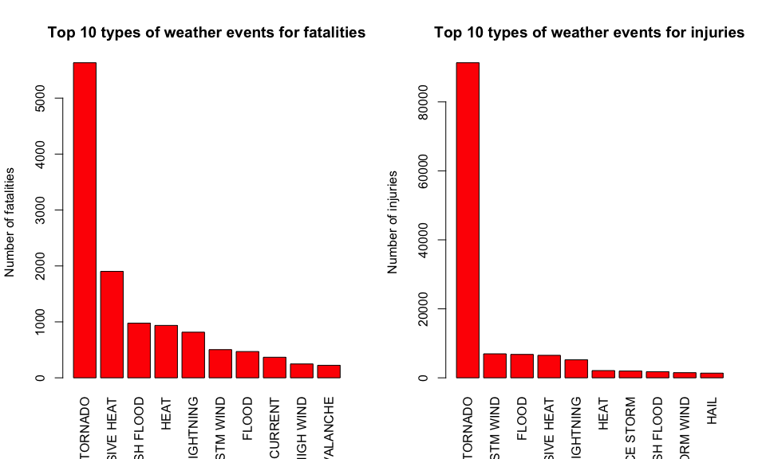
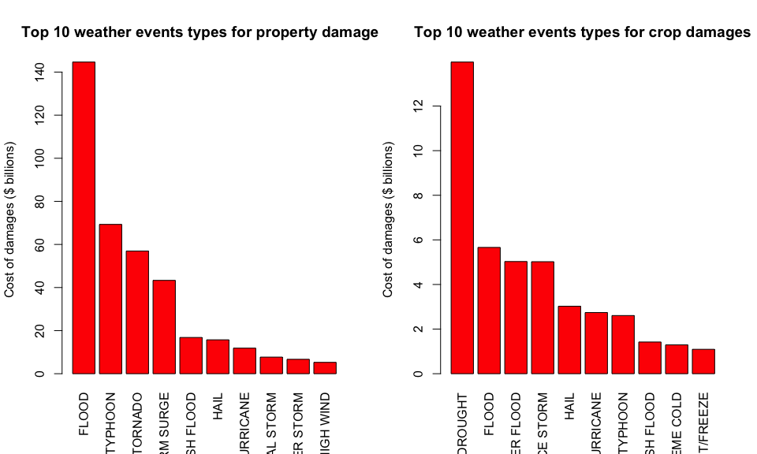

# Reproducible Research: Peer Assessment 2

# Impact of major storms and weather events in the United States

## Synopsis
Storms and other severe weather events can cause both public health and economic problems for communities and municipalities. Many severe events can result in fatalities, injuries, and property damage, and preventing such outcomes to the extent possible is a key concern.

This report involves exploring the U.S. National Oceanic and Atmospheric Administration's (NOAA) storm database. It tries to address the following questions:

1. Across the United States, which types of events (as indicated in the EVTYPE variable) are most harmful with respect to population health?
2. Across the United States, which types of events have the greatest economic consequences?

## Data Processing
First we load the storm data into `StormData`


```r
dataPath <- "~/Downloads/"
StormData <- read.csv(bzfile(paste(dataPath, "StormData.csv.bz2", sep = "")), header = TRUE, stringsAsFactors = FALSE)
```

Then we extract only interested columns: `EVTYPE`, `FATALITIES`, `INJURIES`, `PROPDMG`, `PROPDMGEXP`, `CROPDMG`, `CROPDMGEXP`


```r
ExtractedData <- StormData[, c("EVTYPE", "FATALITIES", "INJURIES", "PROPDMG", "PROPDMGEXP", "CROPDMG", "CROPDMGEXP")]
```

Let's examine variables `PROPDMGEXP` and `CROPDMGEXP`


```r
table(ExtractedData$PROPDMGEXP)
```

```
## 
##             -      ?      +      0      1      2      3      4      5 
## 465934      1      8      5    216     25     13      4      4     28 
##      6      7      8      B      h      H      K      m      M 
##      4      5      1     40      1      6 424665      7  11330
```


```r
table(ExtractedData$CROPDMGEXP)
```

```
## 
##             ?      0      2      B      k      K      m      M 
## 618413      7     19      1      9     21 281832      1   1994
```

Let's convert exponent of `PROPDMGEXP` and `CROPDMGEXP` into numeric values


```r
ExtractedData$PROPDMGEXP[ExtractedData$PROPDMGEXP == "" | ExtractedData$PROPDMGEXP == "?" | ExtractedData$PROPDMGEXP == "+" | ExtractedData$PROPDMGEXP == "-"] <- 0
ExtractedData$PROPDMGEXP[ExtractedData$PROPDMGEXP == "H" | ExtractedData$PROPDMGEXP == "h"] <- 2
ExtractedData$PROPDMGEXP[ExtractedData$PROPDMGEXP == "K" | ExtractedData$PROPDMGEXP == "k"] <- 3
ExtractedData$PROPDMGEXP[ExtractedData$PROPDMGEXP == "M" | ExtractedData$PROPDMGEXP == "m"] <- 6
ExtractedData$PROPDMGEXP[ExtractedData$PROPDMGEXP == "B" | ExtractedData$PROPDMGEXP == "b"] <- 9

ExtractedData$PROPDMGEXP <- as.numeric(ExtractedData$PROPDMGEXP)
```


```r
ExtractedData$CROPDMGEXP[ExtractedData$CROPDMGEXP == "" | ExtractedData$CROPDMGEXP == "?" | ExtractedData$CROPDMGEXP == "+" | ExtractedData$CROPDMGEXP == "-"] <- 0
ExtractedData$CROPDMGEXP[ExtractedData$CROPDMGEXP == "H" | ExtractedData$CROPDMGEXP == "h"] <- 2
ExtractedData$CROPDMGEXP[ExtractedData$CROPDMGEXP == "K" | ExtractedData$CROPDMGEXP == "k"] <- 3
ExtractedData$CROPDMGEXP[ExtractedData$CROPDMGEXP == "M" | ExtractedData$CROPDMGEXP == "m"] <- 6
ExtractedData$CROPDMGEXP[ExtractedData$CROPDMGEXP == "B" | ExtractedData$CROPDMGEXP == "b"] <- 9

ExtractedData$CROPDMGEXP <- as.numeric(ExtractedData$CROPDMGEXP)
```

We are now ready to compute the "real" values of `PROPDMG` and `CROPDMG`


```r
ExtractedData$PROPDMG <- ExtractedData$PROPDMG * (10 ^ ExtractedData$PROPDMGEXP)
ExtractedData$CROPDMG <- ExtractedData$CROPDMG * (10 ^ ExtractedData$CROPDMGEXP)
```

Finally we will aggregate data (`FATALITIES`, `INJURIES`, `PROPDMG`, and `CROPDMG`) by `EVTYPE`


```r
FATALITIES <- aggregate(FATALITIES ~ EVTYPE, data = ExtractedData, FUN = sum)
INJURIES <- aggregate(INJURIES ~ EVTYPE, data = ExtractedData, FUN = sum)
PROPDMG <- aggregate(PROPDMG ~ EVTYPE, data = ExtractedData, FUN = sum)
CROPDMG <- aggregate(CROPDMG ~ EVTYPE, data = ExtractedData, FUN = sum)
```

## Results

### Question 1: Across the United States, which types of events (as indicated in the `EVTYPE` variable) are most harmful with respect to population health?

Let's take 10 most harmful types of events


```r
FATALITIES10 <- FATALITIES[order(FATALITIES$FATALITIES, decreasing = TRUE), ][1:10, ]
INJURIES10 <- INJURIES[order(INJURIES$INJURIES, decreasing = TRUE), ][1:10, ]
```

Top 10 types of events for fatalities


```r
FATALITIES10
```

```
##             EVTYPE FATALITIES
## 834        TORNADO       5633
## 130 EXCESSIVE HEAT       1903
## 153    FLASH FLOOD        978
## 275           HEAT        937
## 464      LIGHTNING        816
## 856      TSTM WIND        504
## 170          FLOOD        470
## 585    RIP CURRENT        368
## 359      HIGH WIND        248
## 19       AVALANCHE        224
```

Top 10 types of events for injuries


```r
INJURIES10
```

```
##                EVTYPE INJURIES
## 834           TORNADO    91346
## 856         TSTM WIND     6957
## 170             FLOOD     6789
## 130    EXCESSIVE HEAT     6525
## 464         LIGHTNING     5230
## 275              HEAT     2100
## 427         ICE STORM     1975
## 153       FLASH FLOOD     1777
## 760 THUNDERSTORM WIND     1488
## 244              HAIL     1361
```


```r
par(mfrow = c(1, 2))
barplot(FATALITIES10$FATALITIES, las = 3, names.arg = FATALITIES10$EVTYPE, main = "Top 10 types of weather events for fatalities", ylab = "Number of fatalities", col = "red")
barplot(INJURIES10$INJURIES, las = 3, names.arg = INJURIES10$EVTYPE, main = "Top 10 types of weather events for injuries", ylab = "Number of injuries", col = "red")
```

 

**"TORNADO" is the most harmful to population health.**

### Question 2: Across the United States, which types of events have the greatest economic consequences?

Let's take 10 types of events with greatest economic consequences


```r
PROPDMG10 <- PROPDMG[order(PROPDMG$PROPDMG, decreasing = TRUE), ][1:10, ]
CROPDMG10 <- CROPDMG[order(CROPDMG$CROPDMG, decreasing = TRUE), ][1:10, ]
```

Top 10 types of events for property damages


```r
PROPDMG10
```

```
##                EVTYPE      PROPDMG
## 170             FLOOD 144657709807
## 411 HURRICANE/TYPHOON  69305840000
## 834           TORNADO  56947380676
## 670       STORM SURGE  43323536000
## 153       FLASH FLOOD  16822673978
## 244              HAIL  15735267513
## 402         HURRICANE  11868319010
## 848    TROPICAL STORM   7703890550
## 972      WINTER STORM   6688497251
## 359         HIGH WIND   5270046295
```

Top 10 types of events for crop damages


```r
CROPDMG10
```

```
##                EVTYPE     CROPDMG
## 95            DROUGHT 13972566000
## 170             FLOOD  5661968450
## 590       RIVER FLOOD  5029459000
## 427         ICE STORM  5022113500
## 244              HAIL  3025954473
## 402         HURRICANE  2741910000
## 411 HURRICANE/TYPHOON  2607872800
## 153       FLASH FLOOD  1421317100
## 140      EXTREME COLD  1292973000
## 212      FROST/FREEZE  1094086000
```


```r
par(mfrow = c(1, 2))
barplot(PROPDMG10$PROPDMG / (10 ^ 9), las = 3, names.arg = PROPDMG10$EVTYPE, main = "Top 10 weather events types for property damages", ylab = "Cost of damages ($ billions)", col = "red")
barplot(CROPDMG10$CROPDMG / (10 ^ 9), las = 3, names.arg = CROPDMG10$EVTYPE, main = "Top 10 weather events types for crop damages", ylab = "Cost of damages ($ billions)", col = "red")
```

 

**"FLOOD" caused the greatest damage to properties. "DROUGHT" caused the greatest damages to crops.**
